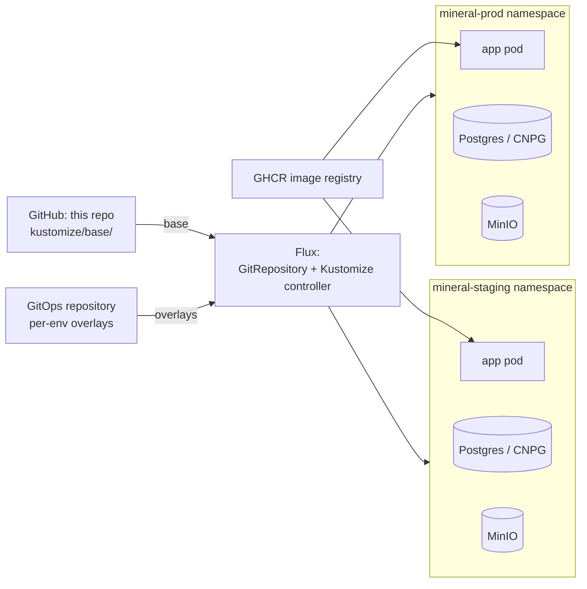

# Minerals Collection

A web app for cataloging a personal collection of minerals, rocks, and
meteorites. v1 is a single-overseer, locally-hosted SPA over a Go API
backed by Postgres + MinIO; see `docs/design/01-scope.md` for the v1
cut line and `CONTRACT.md` for the operational rulebook.

> **License:** [PolyForm Noncommercial 1.0.0](LICENSE).
> Free for personal, educational, research, charitable, and government
> use. Commercial use requires a separate license — please open an
> issue or contact the maintainer.

## Contents

- [Quickstart](#quickstart)
  - [Prerequisites](#prerequisites)
  - [Standard onboarding (full stack in containers)](#standard-onboarding-full-stack-in-containers)
  - [Hot-reload dev (deps in containers, app on the host)](#hot-reload-dev-deps-in-containers-app-on-the-host)
  - [Tear-down](#tear-down)
  - [Local git hooks (optional)](#local-git-hooks-optional)
- [Production deployment](#production-deployment)
- [Where to go next](#where-to-go-next)
- [For AI agents (polecats)](#for-ai-agents-polecats)

## Quickstart

### Prerequisites

- Go 1.25+
- Node 22+
- Docker with Compose v2
- `make`
- `git`

See [CONTRACT.md §3](CONTRACT.md) for the full prerequisites contract.

### Standard onboarding (full stack in containers)

```bash
git clone <repo-url> minerals && cd minerals
docker compose up -d                       # postgres + minio + app
```

Open <http://localhost:8080>. The app builds from the local
`Dockerfile`, auto-applies migrations against Postgres on startup
(dev mode), then serves the embedded SPA on `:8080`. To verify the
backend directly:

```bash
curl -fsS http://localhost:8080/healthz   # → "ok"
```

### Hot-reload dev (deps in containers, app on the host)

For Vite HMR + fast Go rebuilds:

```bash
make compose-deps                          # postgres + minio only
make migrate-up                            # apply migrations against the dev DB
cd frontend && npm ci && cd ..             # one-time

# Two terminals:
make run                                   # backend on :8080
cd frontend && npm run dev                 # Vite on :5173 (proxies to :8080)
```

Open <http://localhost:5173>.

For OIDC login flows (Keycloak on `:8081` + test users), see
[docs/deploy/keycloak.md § Local dev quickstart](docs/deploy/keycloak.md#local-dev-quickstart).

### Tear-down

```bash
make compose-down       # stop everything (volumes preserved)
make compose-down-v     # stop + wipe volumes (fresh DB / MinIO next run)
```

### Local git hooks (optional)

Enforce `make fmt-check` before commit and `make ci-quick` before push,
so the same gates CI runs catch problems on your machine first. Opt-in
per clone:

```bash
make hooks-install
```

This installs [lefthook](https://github.com/evilmartians/lefthook)
into `$GOPATH/bin` if missing and wires up the hooks in `lefthook.yml`.

### Running CI gates locally

Two Makefile targets mirror the GitHub Actions workflow, so you can
reproduce CI failures before pushing:

- `make ci-quick` — fast subset (fmt-check, vet, lint, test, prettier
  + eslint on the frontend). Used by the pre-push hook. Skips the slow
  vuln/license/typecheck gates.
- `make ci-local` — full CI parity: adds `govulncheck`, the SPDX
  license audit, `svelte-check`, and frontend tests with coverage.
  Run before `gt done` / opening a PR.

Tool versions (golangci-lint, gotestsum, govulncheck, go-licenses) are
pinned at the top of the `Makefile` to match CI and auto-install on
demand — no manual setup needed.

## Production deployment

Production deploys to Kubernetes via Flux GitOps. The repo ships a
reusable `kustomize/base/` describing **what to run**; per-environment
overlays in a separate gitops repository describe **how it runs
there** (namespace, hostname, image tag, secrets). The example pattern
uses two environments — `mineral-staging` and `mineral-prod`. Flux polls
the gitops repository, reconciles each overlay against the base, and pulls
container images from GHCR.



See [docs/deploy/README.md](docs/deploy/README.md) for full deployment instructions.

## Where to go next

- **[CONFIG.md](CONFIG.md)** — Reference for every setting the application
  supports (env vars, ConfigMap keys, feature flags) plus the secrets
  inventory.
- **[docs/deploy/README.md](docs/deploy/README.md)** — Full Kubernetes/Flux
  deployment guide.
- **[docs/deploy/keycloak.md](docs/deploy/keycloak.md)** — How to set up
  OIDC authentication with Keycloak.
- **[docs/deploy/secrets.md](docs/deploy/secrets.md)** — Inventory of every
  Secret the deployment consumes.

## For AI agents (polecats)

If you're a polecat (or any AI agent) working on this repo, start here:

- **[CONTRACT.md](CONTRACT.md)** — The operational rulebook: layout, dev
  workflow, CI, migrations, code review rules. Read this before writing
  any code.
- **[CONFIG.md](CONFIG.md)** — Canonical inventory of every tunable
  setting. First stop when adding or changing one.
- **Design docs (frozen v1 decisions and rationale):**
  - [docs/design/01-scope.md](docs/design/01-scope.md) — Scope & v1 cut line
  - [docs/design/02-domain-model.md](docs/design/02-domain-model.md) — Domain model
  - [docs/design/03-files-and-photos.md](docs/design/03-files-and-photos.md) — Photo & file handling
  - [docs/design/04-api-shape.md](docs/design/04-api-shape.md) — API shape
  - [docs/design/05-auth-slot.md](docs/design/05-auth-slot.md) — Auth slot design
  - [docs/design/06-dev-prod-config.md](docs/design/06-dev-prod-config.md) — Dev/prod boundary & config
  - [docs/design/07-build-embed-observability.md](docs/design/07-build-embed-observability.md) — Build, embed, observability
